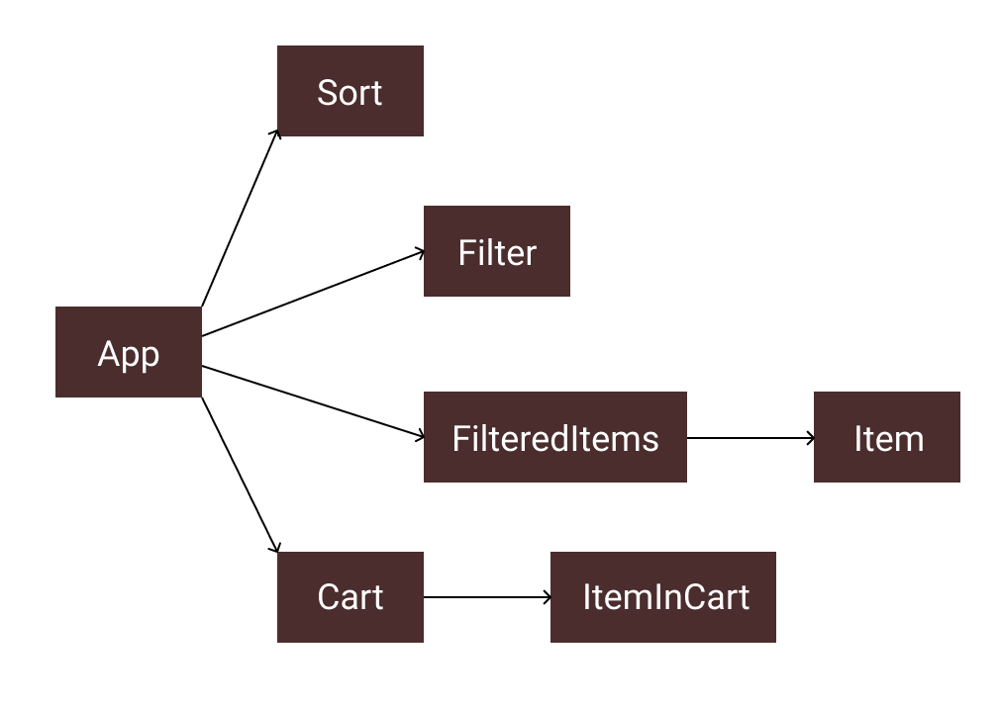

# CS1300 Development: COVID-19 Hoarding Simulator

## component organization

components in this project:
- App
- Cart
- Filter
- FilteredItems
- Item
- ItemInCart
- Sort

## passing data through components
data is stored as state in App and gets passed through to child components via props.

the pieces of state are:
- items—in descriptions, not in cart; passed to FilteredItems, which filters & maps through them to create individual Item components
- priceDirection—from either low to high (initial) or high to low; passed to Sort
- categories—separated into food, other essentials & non-essentials; passed to Filter
- brands—separated into Good Value, Croagur & CarcinoGen; also passed to Filter
- itemsInCart—in cart, not descriptions; passed to Cart, which maps through them to create individual ItemInCart components
- justAdded—true when user just added an item to cart, false otherwise; not passed as props to any components, but gets changed based on activity within individual Item components

## producing state changes
users can interact with the following elements to set the App's state:
- Sort buttons—click to call sortIncreasing() or sortDecreasing() from App passed to this component as props; choose whether to show cheapest or most expensive item descriptions at top
- Filter reset text—click to call resetCategories() or resetBrands() from App passed to this component as props; re-checks all categories
- Filter checkboxes—click to call filterApp() from App passed to this component as props; check/uncheck a category or brand
- Item quantity input—click up/down arrows or enter in a value to call changeQuantity() from App passed through all intermediate components as props; increase/decrease quantity in descriptions
- Item "add to cart" button—click to call addToCart() from App passed through all intermediate components as props; add current quantity of item to cart, set quantity in descriptions back to 0 & briefly show alert at top of page telling user they've added item to cart
- ItemInCart quantity input—click up/down arrows or enter in a value to call changeCartQuantity() from App passed through all intermediate components as props; increase/decrease quantity in cart (if 0, remove from cart)
- ItemInCart "remove all from cart" button—click to call removeFromCart() from App passed through all intermediate components as props; set quantity of item in cart back to 0
- Cart "checkout" button—click to get how much all items in cart cost & alert this total
